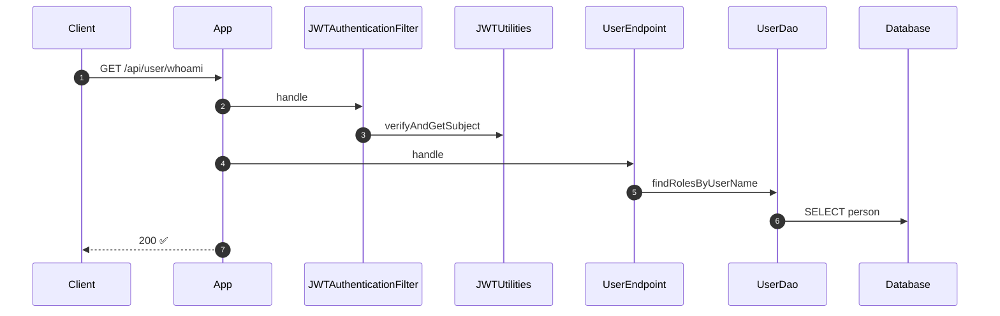
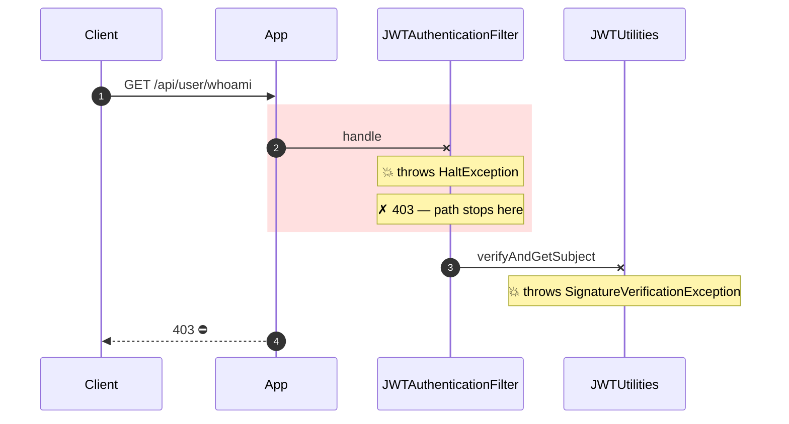

# Behavioral diff — externalize JWT secret breaks GET /api/user/whoami

**Behavioral change detected.** `whoami_admin` returns **200 → 403**.

## Before

## After

## What changed

- **Response 200 → 403** on `GET /api/user/whoami`.
- **Exception introduced:** `handle` now throws `HaltException`.
- **Exception introduced:** `verifyAndGetSubject` now throws `SignatureVerificationException`.
- **Step no longer runs:** `App → UserEndpoint: handle` is gone (code below it is never reached).
- **Step no longer runs:** `UserEndpoint → UserDao: findRolesByUserName` is gone (code below it is never reached).
- **Step no longer runs:** `UserDao → Database: SELECT person` is gone (code below it is never reached).
